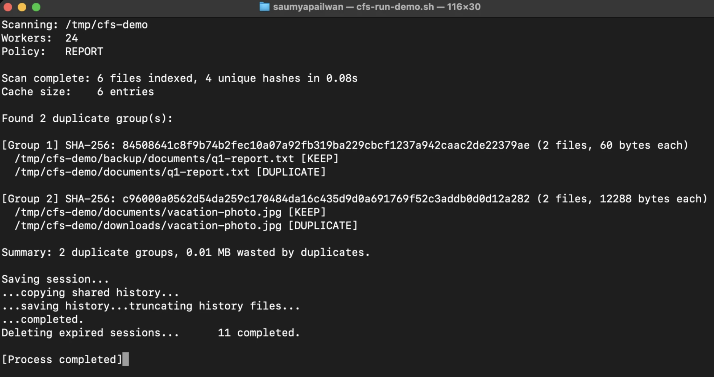

# File System Organizer

A command-line tool that scans a directory tree, finds duplicate files, and lets you report, move, or delete them.

## How it works

Duplicate detection works in three steps. Each step is more expensive than the one before it, and only files that pass a step move to the next one. So the expensive work only happens on a small number of files.

| Tier | Cost | What it does |
|---|---|---|
| 1. File size | Free - already known from traversal | A file whose size is unique cannot have a duplicate, so it is never opened |
| 2. Rabin-Karp rolling hash | Reads the first 4 KB | Files that differ near the start are ruled out without reading the rest |
| 3. SHA-256 | Reads the whole file | Confirms the match beyond collision doubt |

Supporting pieces:

- Folders are scanned breadth first
- File info is cached using a segmented LRU cache, split into shards so threads dont block each other as much
- Both hashing steps run on a fixed pool of worker threads, using a bounded blocking queue to pass work between them

### Why this ordering matters

On a real folder this saves a lot of work. When scanning a Maven repo with 2697 files::

```
Files scanned:            2697
Same-size candidates:     1818   (879 skipped, never read)
Same-prefix candidates:     10   (1808 eliminated after 4 KB each)
Confirmed duplicates:       10
```

Only 10 files were read in full. The other 2,687 were eliminated by a size comparison or a 4 KB read.

## Requirements

- Java 17+
- Maven 3.6+

## Build

```bash
mvn package -DskipTests
```

The jar is produced at `target/concurrent-file-system-organizer-1.0.0.jar`.

## Run

```bash
java -jar target/concurrent-file-system-organizer-1.0.0.jar <directory> [REPORT|MOVE|DELETE]
```

| Mode | Effect |
|---|---|
| `REPORT` | Prints duplicate groups. Nothing is modified. (default) |
| `MOVE` | Moves duplicate copies to `./cfs-output/`. One copy per group is kept in place. |
| `DELETE` | Permanently deletes duplicate copies. One copy per group is kept in place. |

**Always run `REPORT` first** to review what will be affected before using `MOVE` or `DELETE`.

## Example

```bash
java -jar target/concurrent-file-system-organizer-1.0.0.jar ~/demo REPORT
```



## Design notes

1. Scanning the folder happens first, all the way through. The size filter cant tell if a size is unique until every file has been seen, so the whole folder gets scanned before any hashing starts. This is done on purpose: we give up running the scan and the hashing at the same time, but in return we never open a file that a size check could have already ruled out. The two hashing steps still stream through the bounded queue, so we keep things parallel and controlled where the actual reading happens.

2. Empty files are skipped. Every empty file looks exactly the same as every other empty file, so grouping them as duplicates would just create one big useless group. They are counted and reported on their own instead.

3. Files that cant be read are counted, not ignored. If a file cant be read, it is left out of duplicate detection. The scan reports how many files this happened to, and gives a clear warning when running `MOVE` or `DELETE`, since those actions would be working with incomplete information.

## Run tests

```bash
mvn test
```

## Project structure

```
src/main/java/com/cfs/
  Main.java               entry point and result reporting
  config/Config.java      tunable constants (thread count, cache size, etc.)
  pipeline/               duplicate finder and scan statistics
  traversal/              BFS traverser and FileTask value object
  queue/                  bounded blocking queue
  worker/                 thread pool, consumer worker, per-tier action
  hash/                   partial + SHA-256 hasher, duplicate registry
  cache/                  segmented LRU cache
  organizer/              REPORT / MOVE / DELETE logic
```
